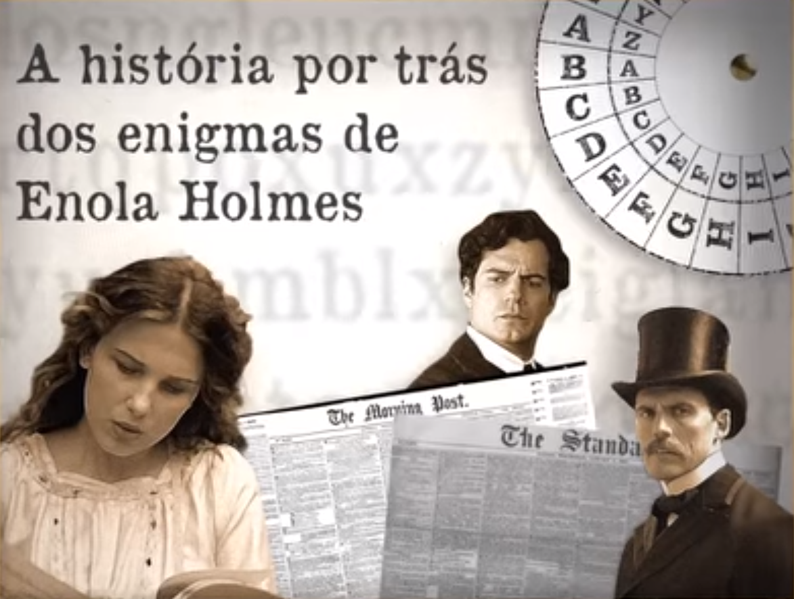

# Cifra de César e a Coluna da Agonia

## 1. Prefácio

Este projeto tem como objetivo criar uma aplicação na qual um usuário possa cifrar e decifrar um texto por meio da Cifra de César. 

A Cifra de César é um tipo de cifra de substituição na qual cada letra de um texto a ser criptografado é substituída por outra letra, presente no alfabeto porém deslocada um certo número de posições.

## 2. Resumo do Projeto

A aplicação deste projeto tem como tema a Coluna da Agonia. Este tema foi baseado em um vídeo chamado "A história por trás dos enigmas de Enola Holmes" produzido pela Netflix para sua página no Facebook sobre o filme _Enola_ _Holmes_ e tem como objetivo complementar o vídeo oferecendo aos espectadores uma **chance de experimentar em primeira mão a comunicação por meio de mensagens cifradas.**

No filme, produção original Netflix, a personagem principal, que se chama Enola Holmes, comunica-se com a sua mãe por meio de mensagens cifradas no jornal. Uma das cifras utilizadas por elas é uma derivação da Cifra de César. O vídeo publicado no Facebook explica que essa forma de comunicação utilizada no filme é baseada em fatos reais. Isso porquê, aa era Vitoriana Inglesa, as regras de conduta não permitiam que os namorados se comunicassem por meio de cartas, então, muitas vezes, esses amantes recorriam a uma coluna de anúncios pessoais no jornal, chamada de Coluna da Agonia. 

A seguir o vídeo da Netflix sobre as mensagens criptografadas no filme Enola Homes:

## 3. Processo e decisões de desenho

Após ter decidido o tema do projeto, a primeira parte da produção foi dedicada em fazer a aplicação funcionar, ou seja, fazer o site ter a função de codificar e descodificar uma mensagem. Decidi que, como no filme, em que a Enola Holmes tem uma "palavra-passe" para decifrar a primeira mensagem da mãe, o usuário poderá escolher entre dar o número (positivo ou negativo) do deslocamento da Cifra de César diretamente ou então criar ele também uma palavra-passe a qual seria considerado o número de caracteres para o número do deslocamento. 

A principal decisão de desenho foi que o site teria três páginas, a principal explicaria resumidamente o que era a Coluna da Agonia e como funciona a Cifra de César, deduzindo que a pessoa que acessou o site já teria visto o filme e o vídeo do facebook. Além disso, essa página apresentaria o "desafio" proposto pela aplicação que é **criar uma Coluna da Agonia _moderna_** na linha do tempo do Facebook ou Twitter. Deste modo, o caminho dos usuários para utilização da página seria:

### Usuário 1
* Acessar a página por meio do link disponibilizado na legenda do vídeo;
* Navegar rapidamente na página introdutória assimilando o desafio proposto;
* Ir para a página "Criptografar", escolher um número de deslocamento ou palavra-passe e escrever uma mensagem para o usuário 2;
* Postar a mensagem criptografada no Facebook e/ou Twitter (assim como antigamente os leitores do jornal mandavam publicar na Coluna da Agonia);
* Mandar o número ou palavra-passe individualmente ao usuário 2 junto com o link da página "Descriptografar";

### Usuário 2
* Acessar a página "Descriptografar";
* Informar o número ou palavra-passe e a mensagem escrita pelo usuário 1;
* **Descobrir o conteúdo da mensagem!**

